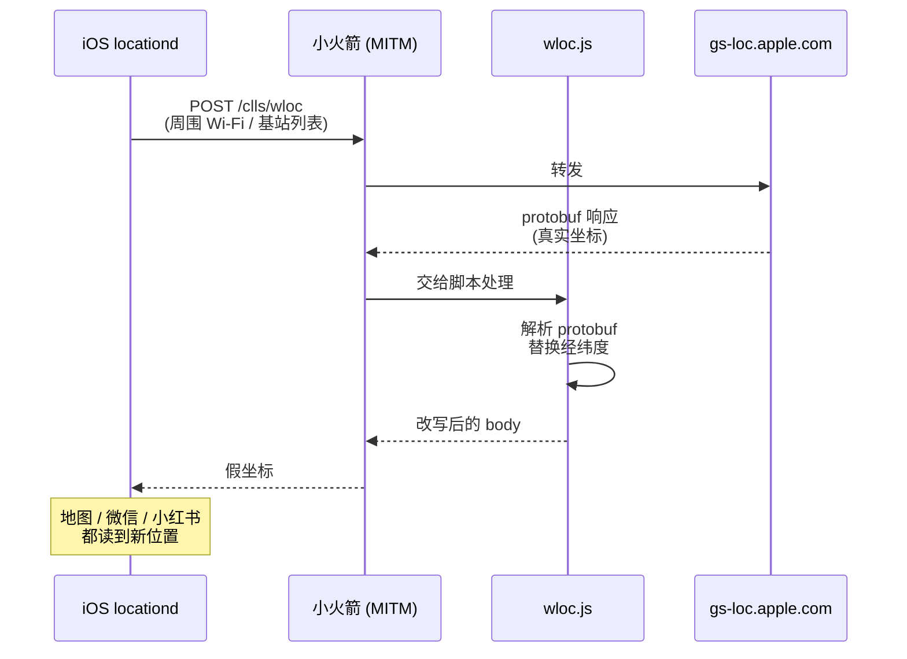
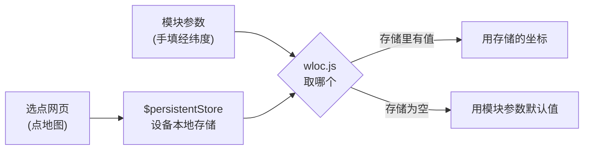

# wloc

**👉 第一次用？直接看 [使用教程（图文版）](使用教程.md)，按步骤操作即可。**

Apple 网络定位（WLOC）坐标修改模块。脚本全部自托管，不依赖任何第三方仓库。

> **免责**：仅供学习和自有设备测试使用。使用需要在代理工具中开启 HTTPS 解密并信任其根证书，风险自负。

## 订阅地址

| Surge / Shadowrocket / Stash | Loon |
|---|---|
| `https://raw.githubusercontent.com/zxishere/wloc/main/wloc.sgmodule` | `https://raw.githubusercontent.com/zxishere/wloc/main/wloc.lpx` |
|  |  |

新手机直接用相机扫码即可打开链接。

## 原理

iPhone 判断自己在哪，除了 GPS，还会把周围的 Wi-Fi 和基站信息发给苹果的定位服务器（`gs-loc.apple.com`）换取坐标。本模块在这条链路的中间把返回的坐标换掉。

只影响**网络定位**（Wi-Fi / 基站），不影响 GPS 硬件定位。所以室内、Wi-Fi 环境下效果最好；户外开阔地带 GPS 信号强时可能盖不住。

## 坐标从哪来

两种写法，写进的是同一份设备本地存储，优先级如下：

选点网页是通过向 `gs-loc.apple.com/wloc-settings/save` 发请求写入的——这条请求根本到不了苹果，会被 `wloc-settings.js` 在**本地**截住。**坐标不出设备。**

## 使用教程

完整的分步图文教程见 **[使用教程.md](使用教程.md)**：导入模块 → HTTPS 解密与证书 → 描述文件与信任 → 选点写入 → 刷新定位 → 恢复。排错表也在那里。

扫码打开本仓库。

## 自建选点页

`index.html` 是本仓库自己的选点页面，已通过 GitHub Pages 发布：

**<https://zxishere.github.io/wloc/>**

它是一个单文件静态页，没有任何后端。功能：

- 点地图或拖图钉选点，支持标准 / 卫星 / 高德三种底图（高德底图自动做 GCJ-02 ↔ WGS-84 转换）
- 手填经纬度、精度、扰动半径
- 「储存到设备」写入坐标，「查询当前」读回当前生效值，「恢复真实定位」清空
- 「读取设备定位」读出 iPhone 此刻认为自己在哪、与目标点相距多少，不用切去地图就能验证是否生效
- 收藏常用位置（存在浏览器本地）
- 地名搜索（直连 OpenStreetMap Nominatim）、坐标文本粘贴
- 支持 URL 参数直接打开：`/?lat=..&lon=..&auto=1` 定位并写入，`/?action=clear` 恢复

它与设备通信的方式：向 `gs-loc.apple.com/wloc-settings/save` 发请求，由 `wloc-settings.js` 在本地拦截。参数说明：

| 参数 | 取值 |
|---|---|
| `action` | `save`（默认） / `query` / `clear` |
| `lat` / `latitude` | 纬度 |
| `lon` / `longitude` | 经度 |
| `acc` / `accuracy` | 精度（米），默认 25 |
| `randomRadius` | 扰动半径（米） |

页面顶部的状态标签会显示「模块已生效 / 模块未生效」，可以用来快速判断解密和证书有没有配好。

外部依赖只剩地图相关的部分：Leaflet（unpkg CDN）、地图瓦片（OpenStreetMap / Esri / 高德）、地名搜索（Nominatim）。坐标本身始终不出设备。

## 脚本审计（2026-09-10）

对本仓库的 `wloc.js`（41,180 B）与 `wloc-settings.js`（13,198 B）做的扫描：

| 检查项 | 结果 |
|---|---|
| `$httpClient` / `$task.fetch` / `fetch()` / `XMLHttpRequest` | **0** |
| `http://` 或 `https://` 字面量 | **0** |
| `$task` | 仅 1 处，位于判断运行环境的 `switch` 分支（识别 Quantumult X） |
| 实际使用的 API | `$persistentStore`（本地存储读写）、`$done`（返回响应） |

即：脚本本身**不具备联网能力**，不会把坐标发给任何人。
