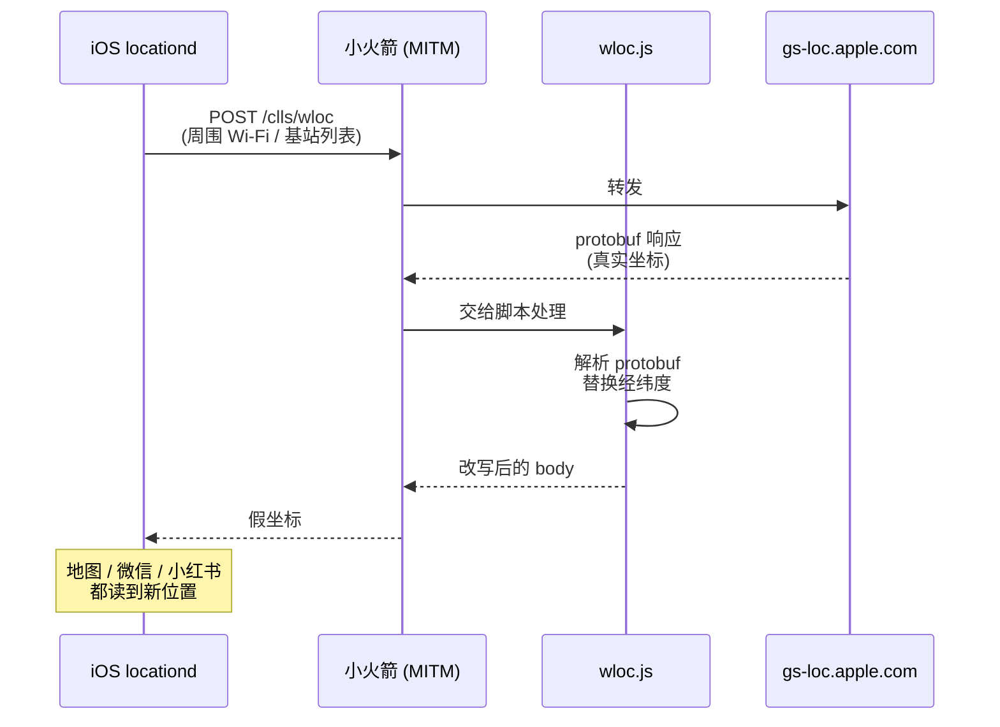
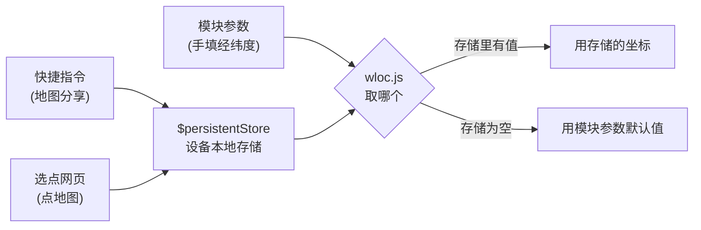

# wloc (personal mirror)

Apple 网络定位（WLOC）坐标修改模块的个人副本。上游作者账号已消失，这里钉一份自己的版本，脚本全部自托管，不依赖任何第三方仓库。

> **免责**：仅供学习和自有设备测试使用。使用需要在代理工具中开启 HTTPS 解密并信任其根证书，风险自负。

## 来源

| | |
|---|---|
| 原作者 / 原项目 | **Yu9191** — `github.com/Yu9191/wloc`（账号已于 2026-09 前后删除，原仓库 404） |
| 本副本文件取自 | 镜像仓库 `ifflagged/Romeo` 的 `Modules/Surge/Yu9191/`、`Modules/Loon/Yu9191/`、`Modules/JavaScript/Yu9191/wloc/` |
| 相对上游的改动 | 仅将两条 `script-path` 指向本仓库；删除一行指向已失效图床的 `#!icon` |
| 教程部分参考 | [@xiaoyuboi 的推文教程](https://x.com/xiaoyuboi/status/2080504555570348292)（步骤经改写，截图版权归原作者） |

## 订阅地址

**Surge / Shadowrocket / Stash**

```
https://raw.githubusercontent.com/zxishere/wloc/main/wloc.sgmodule
```

**Loon**

```
https://raw.githubusercontent.com/zxishere/wloc/main/wloc.lpx
```

## 原理

iPhone 判断自己在哪，除了 GPS，还会把周围的 Wi-Fi 和基站信息发给苹果的定位服务器（`gs-loc.apple.com`）换取坐标。本模块在这条链路的中间把返回的坐标换掉。



只影响**网络定位**（Wi-Fi / 基站），不影响 GPS 硬件定位。所以室内、Wi-Fi 环境下效果最好；户外开阔地带 GPS 信号强时可能盖不住。

## 坐标从哪来

三种写法，写进的是同一份设备本地存储，优先级如下：



后两种是通过向 `gs-loc.apple.com/wloc-settings/save` 发请求写入的——这条请求根本到不了苹果，会被 `wloc-settings.js` 在**本地**截住。**坐标不出设备。**

## 使用教程

### 前期准备

- 一台 iPhone（iOS 15 及以上）
- Shadowrocket（小火箭），App Store 付费应用
- 正常联网

<!--  截图占位：把图片放进 images/ 后取消注释 -->

### 第一步：导入模块

小火箭 →「配置」→「模块」→ 右上角 `+` →「来自 URL」，粘贴：

```
https://raw.githubusercontent.com/zxishere/wloc/main/wloc.sgmodule
```

保存后回到模块列表，确认「Apple WLOC 定位修改」这条是勾选启用状态。

<!--  截图占位：把图片放进 images/ 后取消注释 -->

### 第二步：开启 HTTPS 解密

进入「HTTPS 解密」页面。入口因版本而异：

- 较新版本（如 2.2.88）：「配置」→ 当前使用的配置文件右侧「ⓘ」→「HTTPS 解密」
- 旧版：底部「设置」→「HTTPS 解密」

打开开关，并确认域名列表里包含这五个（导入模块后通常会自动出现）：

```
gs-loc.apple.com
gs-loc-cn.apple.com
gsp-ssl.ls.apple.com
bluedot.is.autonavi.com
bluedot.is.autonavi.com.gds.alibabadns.com
```

<!--  截图占位：把图片放进 images/ 后取消注释 -->

### 第三步：安装并信任证书

这步分三小步，少一步定位就改不了。

**3.1 生成并安装**：HTTPS 解密页 →「证书」→「生成 CA 证书」→「安装证书」→「确认」→ 弹出「已下载描述文件」点「允许」。

> 注意是「生成 CA 证书」，不是「生成新的 CA 证书」，否则不会弹下载描述文件。证书装好后这个选项会消失。

**3.2 安装描述文件**：iPhone 设置 →「通用」→「VPN 与设备管理」→ 找到 Shadowrocket 的描述文件 →「安装」（需输入锁屏密码）。

**3.3 信任证书**（最容易漏）：设置 →「通用」→「关于本机」→ 拉到底「证书信任设置」→ 打开 Shadowrocket 那个证书的开关。

<!--  截图占位：把图片放进 images/ 后取消注释 -->
<!--  截图占位：把图片放进 images/ 后取消注释 -->
<!--  截图占位：把图片放进 images/ 后取消注释 -->

### 第四步：开启代理

回到小火箭首页，打开顶部总开关。首次会弹「是否允许添加 VPN 配置」，点允许，状态栏出现 VPN 图标即可。

### 第五步：设置坐标

**方式 A — 直接改模块参数（最简单，不依赖任何外部服务）**

「配置」→「模块」→ 点开「Apple WLOC 定位修改」，改这几个值：

| 参数 | 默认 | 说明 |
|---|---|---|
| 经度 | 113.94114 | 目标点经度 |
| 纬度 | 22.544577 | 目标点纬度 |
| 精度 | 25 | GPS 精度（米），越小越"精准" |
| 扰动半径 | 0 | 每次响应在目标点周围随机偏移的最大距离（米），0 为关闭 |
| 日志级别 | info | `off/error/warn/info/debug/all`，排错时改 `debug` |

几个常用坐标（纬度在前、经度在后是地图软件的显示顺序，**填的时候别搞反**）：

| 地点 | 纬度 | 经度 |
|---|---|---|
| 北京天安门 | 39.9087 | 116.3975 |
| 上海外滩 | 31.2397 | 121.4900 |
| 广州塔 | 23.1066 | 113.3245 |
| 东京塔 | 35.6586 | 139.7454 |

**方式 B — 快捷指令**（地图里分享一下就设好，见下方「快捷指令」一节）

**方式 C — 选点网页**：<https://zxishere.github.io/wloc/> 点地图选位置，再点「储存到设备」

<!--  截图占位：把图片放进 images/ 后取消注释 -->

### 第六步：让定位生效

改完不会立刻生效，需要"逼" iPhone 重新向苹果请求定位。

- **iOS 15 ~ 18**：设置 →「隐私与安全性」→「定位服务」整个关掉，等 10 秒以上再打开，然后打开地图查看。没变就重复几次。
- **iOS 26 及以上**：Apple 强化了 `locationd` 的定位缓存，关开定位往往没用，**必须重启设备**才能清缓存。建议流程：设好坐标 → 关定位服务 → 重启 → 连上代理 → 打开定位服务 → 打开地图验证。

补充技巧：彻底杀掉地图 / 天气 App 再重开，或在「地图」里点右下角定位箭头强制重新定位。

### 恢复真实定位

取消模块勾选，或关掉小火箭总开关，然后按第六步刷新一次定位即可。用快捷指令的话跑一次「恢复定位」那个。

<!--  截图占位：把图片放进 images/ 后取消注释 -->

## 快捷指令

原作者提供了两个 iCloud 快捷指令，用来在地图里分享一下就把坐标写进设备：

- 设置位置：<https://www.icloud.com/shortcuts/a82717d8fdad4e6280866fcf911173f7>
- 恢复定位：<https://www.icloud.com/shortcuts/f42632d406504f24a2cd163af4fe012f>

> ⚠️ 这两个链接托管在**原作者的 iCloud 账号**下，不在本仓库控制范围内，且 iCloud 分享的快捷指令是可以被所有者更新的。添加前请在「快捷指令」App 里逐条查看动作内容，确认它只是向 `gs-loc.apple.com/wloc-settings/save` 发一个请求。
>
> 完全可以自己重建，逻辑很简单：取输入的位置 → 取经纬度 → 拼出 `https://gs-loc.apple.com/wloc-settings/save?latitude=<纬度>&longitude=<经度>&accuracy=25` → 用「获取 URL 内容」访问它。恢复版把 `action=clear` 传过去即可。

## 自建选点页

`index.html` 是本仓库自己的选点页面，已通过 GitHub Pages 发布：

**<https://zxishere.github.io/wloc/>**

它是一个单文件静态页，没有任何后端。功能：

- 点地图或拖图钉选点，支持标准 / 卫星 / 高德三种底图（高德底图自动做 GCJ-02 ↔ WGS-84 转换）
- 手填经纬度、精度、扰动半径
- 「储存到设备」写入坐标，「查询当前」读回当前生效值，「恢复真实定位」清空
- 收藏常用位置（存在浏览器本地）
- 地名搜索（直连 OpenStreetMap Nominatim）、坐标文本粘贴

它与设备通信的方式和上游一致：向 `gs-loc.apple.com/wloc-settings/save` 发请求，由 `wloc-settings.js` 在本地拦截。参数说明：

| 参数 | 取值 |
|---|---|
| `action` | `save`（默认） / `query` / `clear` |
| `lat` / `latitude` | 纬度 |
| `lon` / `longitude` | 经度 |
| `acc` / `accuracy` | 精度（米），默认 25 |
| `randomRadius` | 扰动半径（米） |

页面顶部的状态标签会显示「模块已生效 / 模块未生效」，可以用来快速判断解密和证书有没有配好。

外部依赖只剩地图相关的部分：Leaflet（unpkg CDN）、地图瓦片（OpenStreetMap / Esri / 高德）、地名搜索（Nominatim）。坐标本身始终不出设备。

## 脚本审计（2026-09-10）

对本仓库的 `wloc.js`（41,180 B）与 `wloc-settings.js`（13,198 B）做的扫描：

| 检查项 | 结果 |
|---|---|
| `$httpClient` / `$task.fetch` / `fetch()` / `XMLHttpRequest` | **0** |
| `http://` 或 `https://` 字面量 | **0** |
| `$task` | 仅 1 处，位于判断运行环境的 `switch` 分支（识别 Quantumult X） |
| 实际使用的 API | `$persistentStore`（本地存储读写）、`$done`（返回响应） |

即：脚本本身**不具备联网能力**，不会把坐标发给任何人。

## 排错

| 现象 | 检查顺序 |
|---|---|
| 定位一直不变 | ① 证书信任设置里的开关是否真的打开（最常见）② 模块是否已启用 ③ HTTPS 解密开关和五个域名是否齐全 ④ 有没有多试几次关/开定位 ⑤ iOS 26+ 有没有重启设备 |
| 想看有没有拦截到 | 把模块参数「日志级别」改成 `debug`，在小火箭「数据 / 日志」里看有没有 wloc 请求 |
| 导入后域名没自动出现 | 手动在 HTTPS 解密页面把那五个域名加进去并保存 |
| Apple News 等区域服务不认 | 设置 →「隐私与安全性」→「定位服务」→「系统服务」，把里面的开关全部打开后再刷新一次定位 |

## 致谢

核心实现来自 **Yu9191**。本仓库只是一份自托管副本，未对脚本逻辑做任何修改。

## 截图

教程里的截图位已经在正文中以 HTML 注释形式留好（`images/01-shadowrocket.jpg` … `images/08-restore.jpg`）。
把对应图片放进 `images/` 目录后，把那几行注释解开即可显示。
