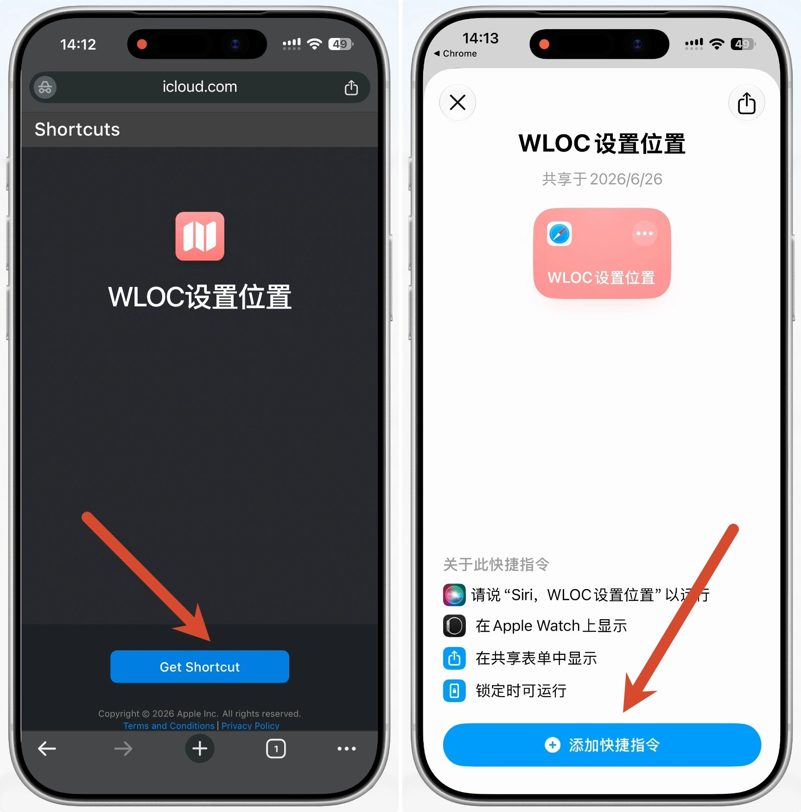
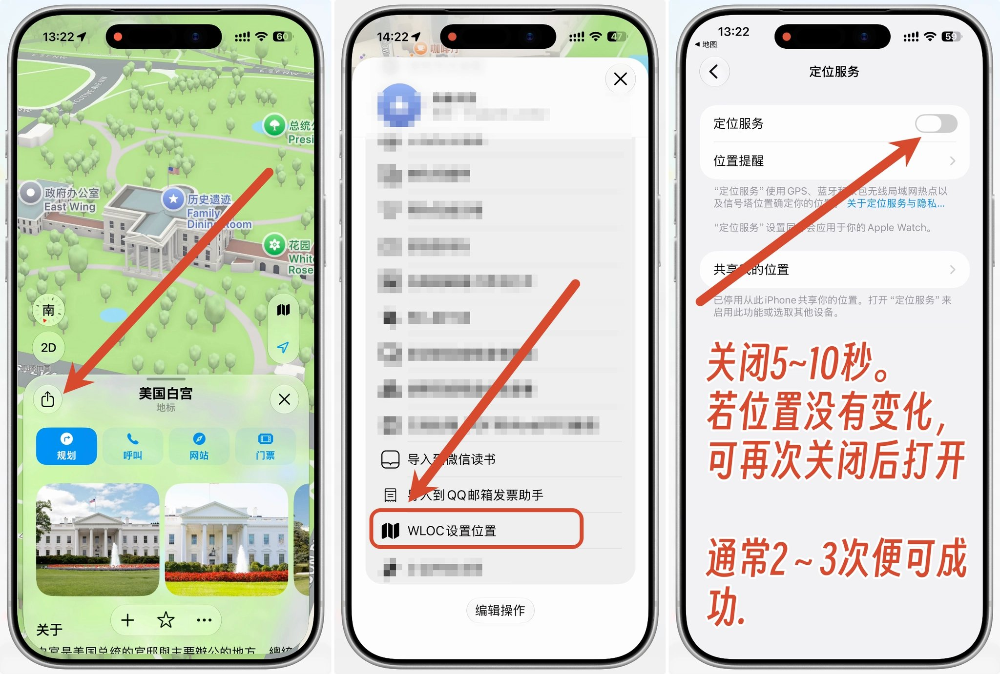
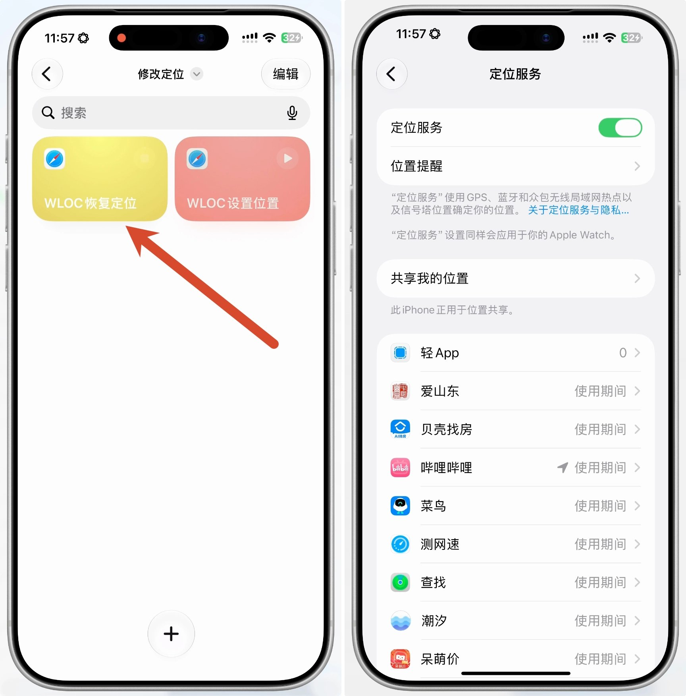

# 使用教程（图文版）

> 目标：不越狱、不用电脑，用 Shadowrocket（小火箭）把 iPhone 的网络定位改到任意位置。
> 全程约 10 分钟，按顺序做即可。卡住了直接跳到文末「排错」。

**一句话原理**：iPhone 会把周围 Wi-Fi / 基站信息发给苹果服务器换取坐标，本模块在半路把返回的坐标换成你指定的位置。只影响网络定位，不碰 GPS 硬件。

## 效果

地图、微信、小红书等应用读到的都是新位置，微信实时位置共享同样有效。


## 准备

- iPhone（iOS 15 及以上）
- **Shadowrocket**（App Store 付费应用，装好即可，不需要任何节点）
- 能正常联网


---

## 第一步：导入模块

打开小火箭 → 底部「配置」→ 找到「模块」→ 右上角 `+` → 选「来自 URL」，粘贴：

```
https://raw.githubusercontent.com/zxishere/wloc/main/wloc.sgmodule
```

点「下载」。回到模块列表，确认「Apple WLOC 定位修改」这一条**右侧已勾选启用**。


---

## 第二步：开启 HTTPS 解密并生成证书

1. 「配置」页 → 点你**正在使用的配置文件**右侧的 `ⓘ`
2. 进入「HTTPS 解密」→ 打开开关（变蓝）
3. 确认下方域名列表里有这五个（导入模块后一般会自动出现；没有就点 `+` 手动加）：

```
gs-loc.apple.com
gs-loc-cn.apple.com
gsp-ssl.ls.apple.com
bluedot.is.autonavi.com
bluedot.is.autonavi.com.gds.alibabadns.com
```

4. 同一页面点「证书」→「生成 CA 证书」

生成后能看到证书的日期时间，下方会提示「未被系统信任」——这是正常的，下一步就去信任它。

> 旧版小火箭的「HTTPS 解密」入口在底部「设置」里，找不到就去那儿看。


---

## 第三步：安装证书

在「证书」页点「**安装证书**」→「"localhost" 正尝试下载配置描述文件」→ 点「**允许**」。


---

## 第四步：安装描述文件并信任证书（最容易漏）

这步分两半，缺一不可：

**① 安装描述文件**
打开 iPhone「设置」→ 最上方会出现「已下载描述文件」→ 点进去 →「安装」→ 输入锁屏密码 → 完成。
（如果最上方没出现，去「通用」→「VPN 与设备管理」里找 Shadowrocket 的描述文件。）

**② 信任证书**
「设置」→「通用」→「关于本机」→ 滑到最底「**证书名任设置**」→ 把、Shadowrocket、那条开关打开。

做完回到小火箭，证书页会显示「已被系统信任」。点右上角 ✓ 保存退出。


---

## 第五步：开启代理

回到小火箭首页，把顶部总开关打开。首次会弹「是否允许添加 VPN 配置」→ 允许。状态栏出现 **VPN** 图标即可。

到这里你的 iPhone 已经具备改定位的能力了，剩下的只是"告诉它去哪"。

---

## 第六步：设置坐标

三种方式任选，效果一样。

### 方式 A：选点网页（推荐）

打开 **<https://zxishere.github.io/wloc/>**（本仓库自建，无后端）：

- 页面顶部若显示「模块已生效」，说明前五步都对了
- 点地图 / 拖图钉 / 搜地名 / 粘坐标，选好位置
- 点「**储存到设备**」

### 方式 B：直接改模块参数

小火箭 →「配置」→「模块」→ 点开「Apple WLOC 定位修改」，改「经度」「纬度」两项，保存。

| 地点 | 纬度 | 经度 |
|---|---|---|
| 北京天安门 | 39.9087 | 116.3975 |
| 上海外滩 | 31.2397 | 121.4900 |
| 东京塔 | 35.6586 | 139.7454 |
| 美国白宫 | 38.8977 | -77.0365 |

注意别把经纬度填反。

### 方式 C：快捷指令

原作者提供了两个 iCloud 快捷指令，装好后可以在地图里「分享 → WLOC 设置位置」一步设好：

- 设置位置：<https://www.icloud.com/shortcuts/a82717d8fdad4e6280866fcf911173f7>
- 恢复定位：<https://www.icloud.com/shortcuts/f42632d406504f24a2cd163af4fe012f>

浏览器打开链接 →「Get Shortcut」→「添加快捷指令」。

> ⚠️ 这两个链接托管在原作者的 iCloud 账号下，不受本仓库控制，且所有者可以随时更新内容。添加前请在快捷指令 App 里展开看一遍动作，确认它只访问 `gs-loc.apple.com`。用方式 A 就完全不需要它。



用快捷指令改定位：地图里搜到目标 → 点分享 → 下滑选「WLOC 设置位置」→ 它会自动跳到「定位服务」。



---

## 第七步：让定位生效

坐标写进去后**不会立刻生效**，要逼 iPhone 重新向苹果请求一次定位：

**iOS 15 ~ 18**

「设置」→「隐私与安全性」→「定位服务」→ 整个关掉 → 等 5~10 秒 → 再打开 → 打开「地图」看位置。没变就再关开一次，通常 2~3 次内成功。

**iOS 26 及以上**

系统会把真实定位缓存在内存里长期复用，光关开定位往往不管用，**需要重启设备**。推荐顺序：设好坐标 → 关掉定位服务 → 重启 → 确认小火箭 VPN 图标在 → 打开定位服务 → 打开地图验证。

补充技巧：彻底杀掉地图 / 天气 App 再打开，或在地图里点右下角定位箭头强制刷新。

生效后微信、地图都会显示新位置：


---

## 恢复真实定位

任选其一，然后按第七步刷新一次定位：

- 选点网页点「恢复真实定位」
- 或运行快捷指令「WLOC 恢复定位」
- 或直接在小火箭里取消模块勾选 / 关掉总开关



---

## 排错

| 现象 | 依次检查 |
|---|---|
| 定位一直不变 | ① 「证书信任设置」的开关是否真的打开（**最常见**） ② 模块是否已启用 ③ HTTPS 解密开关和五个域名 ④ 关/开定位有楡有重试几次 ⑤ iOS 26+ 有没有重启 |
| 选点网页显示「模块未生效」 | 代理总开关没开，或证书 / 解密没配好，回到第二~五步逐项对照 |
| 想确认有���有拦到请求 | 模块参数「日志级别」改成 `debug`，在小火箭「数据 / 日志」里找 wloc |
| 导入模块后域名没自动出现 | 在 HTTPS 解密页手动加上那五个域名并保存 |
| 只有部分 App 变了 | 「定位服务」→「系统服务」里的开关全部打开，再刷新一次定位 |
| 户外开阌处不生效 | 正常。本方案只改网络定位（Wi-Fi/基站），GPS 信号强时会被 GPS 覆盖，室内效果最好 |

---

## 关于截图

本文截图来自 [@xiaoyuboi 的推文教程](https://x.com/xiaoyuboi/status/2080504555570348292)，版权归原作者，文字步骤为重写。原教程中的订阅地址（Yu9191/wloc）已随作者账号删除而失效，本文已替换为本仓库地址。
