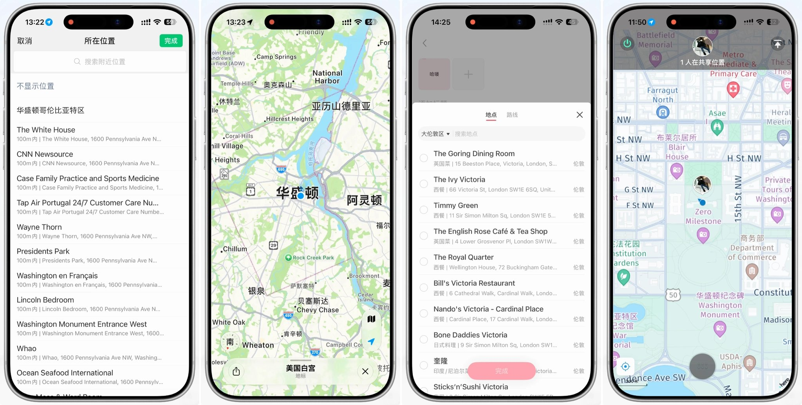
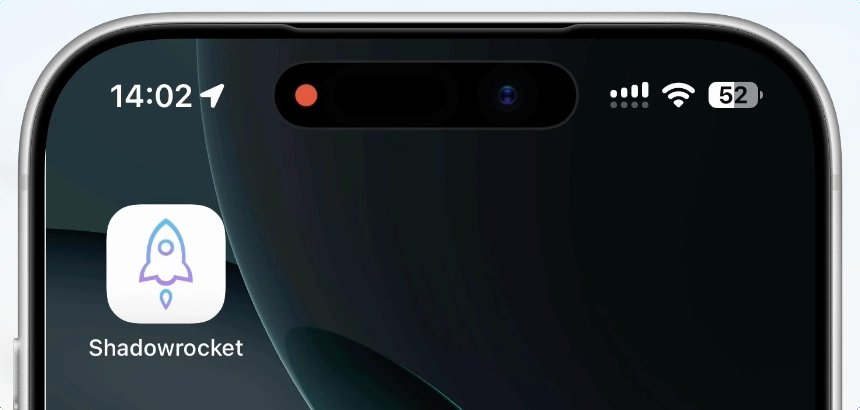
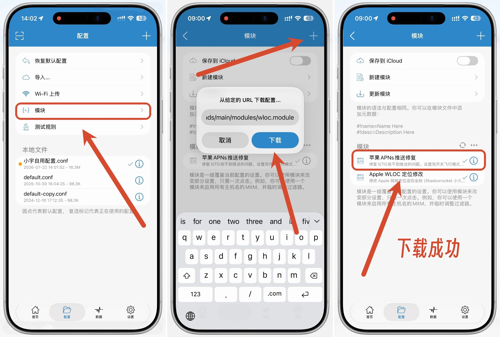
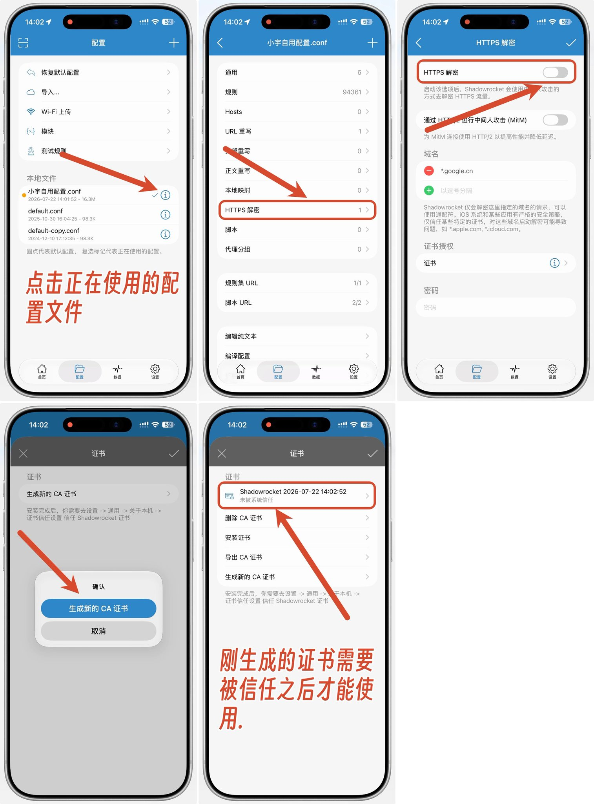
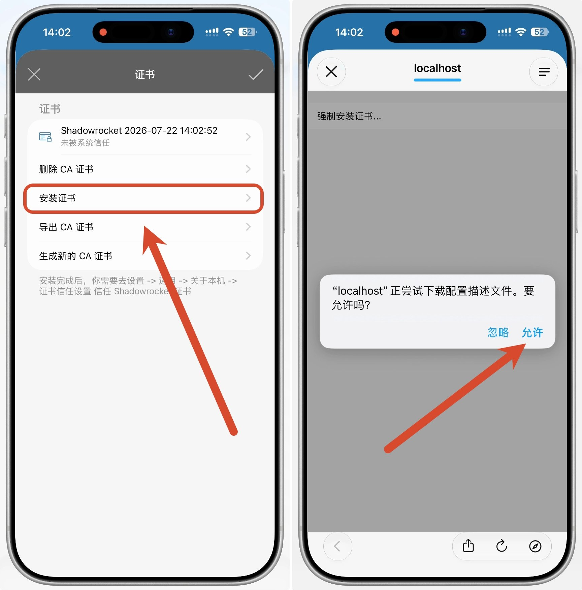
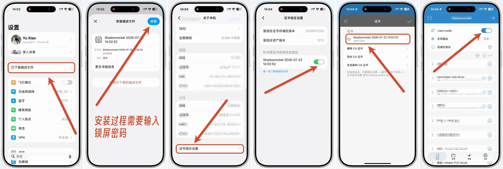
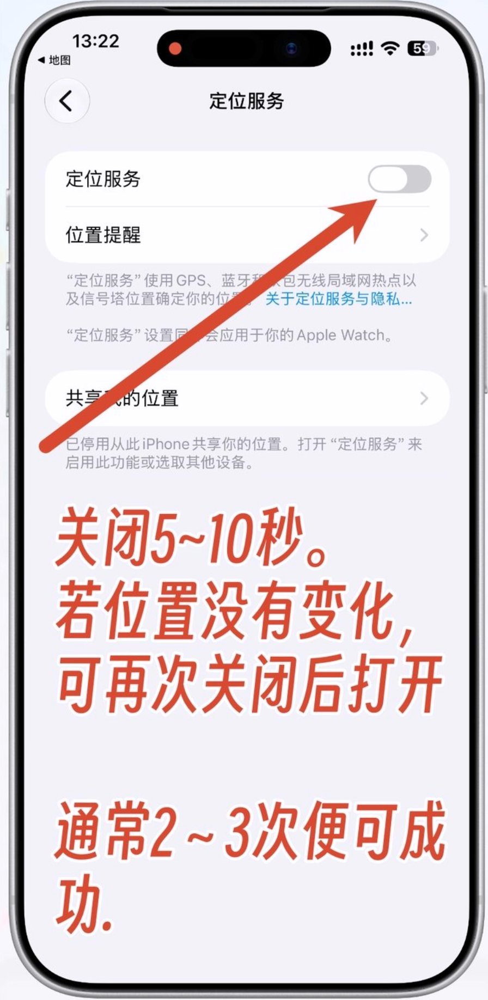
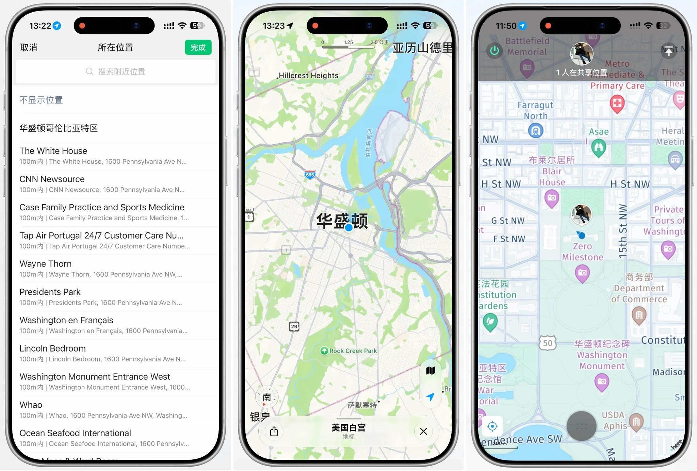

# 使用教程（图文版）

> 用 Shadowrocket（小火箭）把 iPhone 的定位改到任意位置，不越狱、不用电脑。按顺序做即可，全程约 10 分钟。

**原理一句话**：iPhone 会把周围 Wi-Fi / 基站信息发给苹果服务器换取坐标，本模块在半路把返回的坐标换成你指定的位置。地图、微信、小红书等都会读到新位置，微信实时位置共享同样有效。



---

## 1、前期准备

- 一台 iPhone
- **Shadowrocket**（小火箭），App Store 付费应用，装好即可，不需要任何节点



---

## 2、具体操作

### 1）安装模块

打开小火箭 → 点「模块」→ 右上角 `+` → 把下面这个链接粘贴进去 → 点「下载」：

```
https://raw.githubusercontent.com/zxishere/wloc/main/wloc.sgmodule
```

新手机不方便打字的话，用相机扫这个码，长按链接「拷贝」即可：


下载成功后，列表里会出现「Apple WLOC 定位修改」这一条。



### 2）安装证书

**① 生成证书**

在「配置」页，点你**正在使用的配置文件右侧的图标** → 点「HTTPS 解密」→ 打开解密功能 → 点「**生成新的 CA 证书**」。

这里能看到新生成证书的日期时间，下方会显示「未被系统信任」——这是正常的，接下来就去信任它。



**② 安装证书**

证书被信任之后才能用。点「**安装证书**」→ 弹窗点「**允许**」，之后描述文件就下载到系统里了。



**③ 在系统里安装并信任**

1. 打开 iPhone「设置」，最上方会显示「**已下载描述文件**」，点进去 →「安装」，过程中需要输入锁屏密码
2. 安装完成后返回上一层，点「**关于本机**」→ 滑到最底部 → 点「**证书信任设置**」→ 打开 Shadowrocket 那条开关

回到小火箭，就能看到此证书已经被信任了。点右上角对勾保存退出，然后**打开小火箭的总开关**。



到这里你的 iPhone 已经拥有修改定位的能力了。

---

## 3、修改虚拟定位

打开选点网页（本仓库自建，单文件静态页，没有后端）：

**<https://zxishere.github.io/wloc/>**


1. 页面顶部的标签若显示「**模块已生效**」，说明前面证书那几步都对了；显示「模块未生效」就回去检查小火箭总开关和证书信任
2. 点地图选位置，或拖图钉、搜地名、直接粘坐标
3. 点「**储存到设备**」
4. 把 iPhone 的**定位服务关掉**（设置 → 隐私与安全性 → 定位服务），等 5～10 秒，再打开。若位置没变，可再次关闭后打开，通常 2～3 次便可成功



5. 回到网页点「**读取设备定位**」，页面会显示 iPhone 此刻认为自己在哪、和目标点相距多少——差几十米以内就是成功了

如果还是不行，**重启设备**来清除之前的位置缓存（iOS 26 及以上系统缓存较强，一般都需要重启一次）。

成功后微信、地图都会显示新位置，实时位置共享也一样：



---

## 4、恢复位置信息

选点网页上点「**恢复真实定位**」，然后同样去「定位服务」关 5～10 秒再打开，刷新一次位置缓存即可。

也可以直接在小火箭里取消模块勾选、或关掉总开关，效果相同。

---

## 排错

| 现象 | 依次检查 |
|---|---|
| 定位一直不变 | ① 「证书信任设置」的开关是否真的打开（**最常见**）② 模块是否已启用 ③ HTTPS 解密是否打开 ④ 关/开定位有没有多试几次 ⑤ 重启过设备没有 |
| 选点网页显示「模块未生效」 | 小火箭总开关没开，或证书 / 解密没配好，回到「安装证书」逐项对照 |
| 「读取设备定位」提示拒绝 | 设置 → 隐私与安全性 → 定位服务 → Safari 网站，改为「使用 App 期间」 |
| HTTPS 解密的域名列表里没有 `gs-loc.apple.com` | 正常情况下导入模块会自动加进去。若没有，手动点 `+` 加上 `gs-loc.apple.com` 和 `gs-loc-cn.apple.com` 并保存 |
| 想确认有没有拦到请求 | 模块参数「日志级别」改成 `debug`，在小火箭「数据 / 日志」里找 wloc |
| 只有部分 App 变了 | 「定位服务」→「系统服务」里的开关全部打开，再刷新一次定位 |
| 户外开阔处不生效 | 正常。本方案只改网络定位（Wi-Fi / 基站），GPS 信号强时会被 GPS 覆盖，室内效果最好 |
